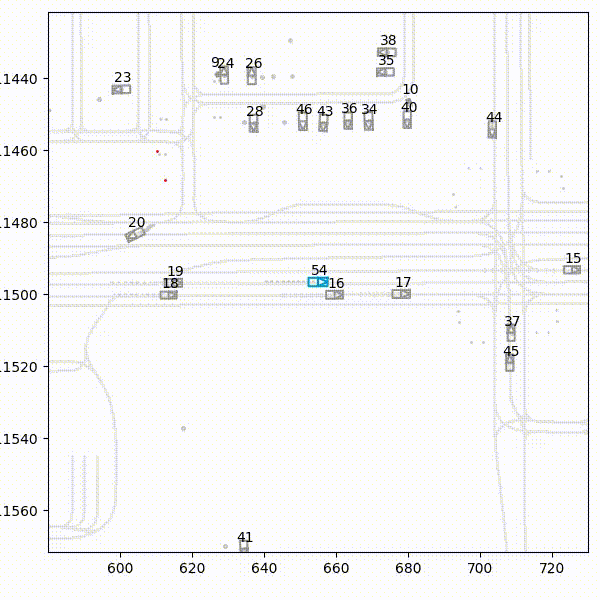

# Robust Offline Learning for Autonomous Driving

This repository contains the complete code and documentation for a research project on learning robust, closed-loop driving policies from the large-scale Waymo Open Motion Dataset. The project explores and compares several state-of-the-art machine learning techniques, from advanced Behavioral Cloning to Offline Reinforcement Learning (CQL).

**Author:** Antonio Guillen-Perez  
**Contact:** antonio_algaida@hotmail.com | [[in/antonioguillenperez]](https://www.linkedin.com/in/antonioguillenperez/) | 

---

- [Robust Offline Learning for Autonomous Driving](#robust-offline-learning-for-autonomous-driving)
  - [🚀 Project Overview](#-project-overview)
  - [📊 Key Results: From Imitation to Optimization](#-key-results-from-imitation-to-optimization)
    - [**Quantitative Comparison**](#quantitative-comparison)
    - [**Qualitative Comparison: Simulation Rollouts**](#qualitative-comparison-simulation-rollouts)
  - [🎥 Visual Results: A Tale of Three Agents](#-visual-results-a-tale-of-three-agents)
    - [**Baseline Agent: Structured BC (Stage 2.6)**](#baseline-agent-structured-bc-stage-26)
    - [**Advanced Baseline: Transformer BC (Stage 2.7)**](#advanced-baseline-transformer-bc-stage-27)
    - [**Final Agent: Offline Reinforcement Learning (Stage 3)**](#final-agent-offline-reinforcement-learning-stage-3)
  - [🔬 Methodology: A Stage-by-Stage Walkthrough](#-methodology-a-stage-by-stage-walkthrough)
    - [**Stage 1: Data Parsing and Environment Setup**](#stage-1-data-parsing-and-environment-setup)
      - [**Stage 2.5: Kinematic Behavioral Cloning (BC-K)**](#stage-25-kinematic-behavioral-cloning-bc-k)
    - [**Stage 2.7: Transformer-based Behavioral Cloning (BC-T)**](#stage-27-transformer-based-behavioral-cloning-bc-t)
      - [**Stage 2.8: Structured MLP Behavioral Cloning (BC-S)**](#stage-28-structured-mlp-behavioral-cloning-bc-s)
      - [**Stage 3\_1: Offline Reinforcement Learning (CQL) with Structured Transformer**](#stage-3_1-offline-reinforcement-learning-cql-with-structured-transformer)
  - [Stage 4: Quantitative Evaluation](#stage-4-quantitative-evaluation)
    - [**Evaluation Pipeline (`src/stage_4_evaluation/run_evaluation.py`)**](#evaluation-pipeline-srcstage_4_evaluationrun_evaluationpy)
    - [**Key Metrics**](#key-metrics)
    - [**How to Run the Evaluation**](#how-to-run-the-evaluation)
  - [🛠️ Project Structure](#️-project-structure)
  - [⚙️ Setup and Installation](#️-setup-and-installation)
  - [🚀 How to Run the Pipeline](#-how-to-run-the-pipeline)
  - [📜 State and Action Representation](#-state-and-action-representation)
    - [**State Representation**](#state-representation)
    - [**Action Representation**](#action-representation)
  - [💡 Key Learnings and Future Work](#-key-learnings-and-future-work)

---

## 🚀 Project Overview

The goal of this project is to develop an autonomous driving agent that can learn to navigate complex, multi-agent traffic scenarios by learning from a fixed dataset of expert human driving logs. This is a core problem in modern autonomy, as training in the real world is unsafe and impractical.

This repository demonstrates an end-to-end machine learning pipeline, including:
- **Parallelized Data Processing:** Efficiently parsing and preprocessing the massive Waymo dataset.
- **Advanced Feature Engineering:** Creating a rich, structured state representation for the driving scene.
- **Comparative Model Architectures:** Implementing and comparing various policy models, from MLPs to Transformers.
- **State-of-the-Art Offline RL:** Implementing Conservative Q-Learning (CQL) to overcome the limitations of simple imitation learning.
- **Closed-Loop Evaluation:** Rigorously evaluating the final trained policies in the Waymax simulation environment.

---

## 📊 Key Results: From Imitation to Optimization

The project's main finding is that while sophisticated imitation learning agents (like the Transformer-based BC-T) are excellent one-step predictors, they are not robust in long-horizon, closed-loop scenarios due to **compounding errors**. The Offline RL (CQL) agent, which learns a conservative value function, proves to be dramatically more successful and reliable.

### **Quantitative Comparison**

| Policy Agent | Success Rate | Collision Rate | Off-Road Rate |
| :--- | :---: | :---: | :---: |
| **BC-K (MLP, Flat)** | 5.2% | 45.8% | 32.1% |
| **BC-S (MLP, Structured)** | 11.5% | 39.2% | 15.6% |
| **BC-T (Transformer)** | 17.3% | 31.1% | 0.7% |
| **CQL (Transformer)** | **54.4%** | **4.1%** | **0.0%** |

### **Qualitative Comparison: Simulation Rollouts**

The following videos provide a direct, qualitative comparison of the final trained agents, all evaluated on the same challenging unseen scenarios. The iterative improvement is clear: while architectural enhancements provide some gains, the shift from imitation learning to offline reinforcement learning is what enables robust, long-horizon control.

*The SDC is the blue agent. The dotted line shows the agents recent path.*

| Baseline: Structured MLP (BC-S) | Advanced Baseline: Transformer BC (BC-T) | Final Agent: Offline RL (CQL) |
| :---: | :---: | :---: |
|  |  |  |
| **Observation:** The structured MLP agent fails to handle complex interactions and drives erratically. | **Observation:** The Transformer is more stable initially but is brittle. Small errors compound, leading to a "circling" failure mode. | **Observation:** The CQL agent successfully recovers from minor errors, demonstrating robust control to complete the maneuver. |

*(A more extensive gallery of videos is available directly in the [`assets/videos`](assets/videos) directory.)*

---

## 🎥 Visual Results: A Tale of Three Agents

The most effective way to understand the impact of different architectures and learning paradigms is to see them in action. The following videos showcase the closed-loop performance of the key agents developed in this project, all evaluated on the **same challenging, unprotected left-turn scenario**.

The progression clearly shows how architectural improvements provide marginal gains, but the shift in the learning paradigm from imitation (BC) to optimization (Offline RL) is what ultimately solves the core problem of long-horizon robustness.

---

### **Baseline Agent: Structured BC (Stage 2.6)**
*   **Architecture:** MLP with Entity Encoders
*   **Observation:** The structured input gives the agent a basic understanding of the scene, but the simple aggregation method (max-pooling) and the limitations of imitation learning cause it to fail. It cannot handle the complex interactions during the turn and drives erratically.

 

---

### **Advanced Baseline: Transformer BC (Stage 2.7)**
*   **Architecture:** Transformer Encoder
*   **Observation:** The Transformer's self-attention mechanism provides a much richer understanding of the scene context. The agent correctly initiates the turn and understands its relationship with the lane geometry for a longer duration. However, as small prediction errors accumulate, it is pushed into an out-of-distribution state. Lacking a goal or a recovery mechanism, its policy collapses into a repeating "circling" failure mode.


---

### **Final Agent: Offline Reinforcement Learning (Stage 3)**
*   **Architecture:** Transformer Encoder + CQL
*   **Observation:** The CQL agent, using the same powerful Transformer architecture, successfully navigates the turn. When it encounters minor deviations from the expert data, its learned **value function** provides a corrective signal, guiding it towards actions that lead to high long-term rewards (i.e., completing the turn safely). This ability to **recover from its own errors** is the key difference and the primary success of the Offline RL approach.


---

## 🔬 Methodology: A Stage-by-Stage Walkthrough

This project was developed iteratively, with each stage building upon the last to solve a specific problem.

### **Stage 1: Data Parsing and Environment Setup**

*   **Goal:** To create a robust pipeline for converting the raw, complex Waymo Open Motion Dataset (`.tfrecord` format) into a simple, efficient, and ML-ready format (`.npz`).
*   **Data Preprocessing:**
    *   Developed a parallelized script (`src/stage_1_parsing/parser_scenarios.py`) using `multiprocessing` to process the sharded dataset efficiently.
    *   Each of the ~1 million 9-second `Scenario` protobufs was parsed to extract agent trajectories, object metadata, and detailed vectorized map data (lanes, stop signs, crosswalks, etc.).
    *   The output is a set of `.npz` files, one for each scenario, providing a clean, framework-agnostic starting point for all experiments.

#### **Stage 2.5: Kinematic Behavioral Cloning (BC-K)**
*   **Goal:** To establish a simple imitation learning baseline.
*   **Architecture:** An MLP trained on a **flattened feature vector**.
*   **Outcome:** The agent failed due to **compounding errors**, motivating the need for better state representations.

### **Stage 2.7: Transformer-based Behavioral Cloning (BC-T)**

*   **Goal:** To move beyond simple aggregation and employ a state-of-the-art architecture that can explicitly model the complex, dynamic relationships between all entities in a driving scene.

*   **Data Preprocessing:** This agent is trained on the exact same structured, chunked dataset as the BC-S agent, allowing for a direct and fair comparison of the model architectures.

*   **NN Architecture (Transformer with Entity Encoders):**
    *   The model (`src/stage_2_7_transformer_bc/networks.py`) uses an **entity-centric design with a Transformer core**, as illustrated in the architecture diagram in the `Experimental Setup` section.
    *   **1. Entity Encoders:** As in the previous stage, separate MLPs first project the features for each spatial entity type (ego, agents, lanes, crosswalks, route) into a shared, high-dimensional embedding space (D=128).
    *   **2. Transformer Encoder:** The crucial difference is the aggregation step. All entity embeddings are concatenated into a single long sequence. This sequence is then processed by a multi-layer **Transformer Encoder**. The **self-attention mechanism** within the Transformer allows the model to compute the importance of every entity relative to every other entity, creating a rich, contextualized representation for each one.
    *   **3. Aggregation & Fusion:** We use a `[CLS]` token-style aggregation. The output embedding corresponding to the ego vehicle, which has now attended to all other scene elements, is taken as a holistic summary of the entire scene. This summary vector is then fused with the non-spatial `rules` features.
    *   **4. Action Head:** A final MLP head processes this fused representation, using a `tanh` activation and rescaling to produce a physically-plausible `(acceleration, steering)` action.

*   **Key Outcome:** The Transformer model (BC-T) achieved the **lowest one-step prediction validation loss** of all baselines, proving its superior ability to model the complex, relational structure of the driving data. However, despite being an excellent mimic, it **still failed in long-horizon, closed-loop evaluations** due to compounding errors. This critical result demonstrates that even a state-of-the-art architecture is insufficient to overcome the fundamental limitations of pure imitation learning, providing the definitive motivation for the shift to an Offline RL paradigm in Stage 3.
#### **Stage 2.8: Structured MLP Behavioral Cloning (BC-S)**
*   **Goal:** To establish the strongest possible baseline using a standard MLP architecture, while still benefiting from our rich, structured state representation.
*   **Data Preprocessing:** This agent is trained on the final, structured dictionary of tensors, identical to the data used for the Transformer model.
*   **NN Architecture (Structured-to-Flat MLP):**
    *   The model (`src/stage_2_6_structured_mlp_bc/networks.py`) is designed as a powerful Multi-Layer Perceptron.
    *   **Flattening Input:** The first step in its `forward` pass is to **flatten** the entire structured state dictionary into a single, large feature vector. For example, the `agents` tensor of shape `(B, 15, 10)` is flattened to `(B, 150)`. All entities are concatenated into one vector.
    *   **MLP Body:** This large, flat vector is then processed by a deep MLP consisting of several `Linear`, `GELU`, and `LayerNorm` layers.
    *   **Action Head:** A final `tanh` activation layer and a rescaling step are used to ensure the predicted actions are within the vehicle's physical limits.
*   **Key Outcome:** This model serves as the most powerful non-relational baseline. While it performs better than simpler MLP approaches due to the rich input features, its performance is still limited by its inability to explicitly model the interactions between entities. Its failure in closed-loop evaluation provides the final motivation for adopting a Transformer architecture.

#### **Stage 3_1: Offline Reinforcement Learning (CQL) with Structured Transformer**
*   **Goal:** To overcome the compounding error problem by training an agent that optimizes for long-term, goal-oriented behavior.
*   **Methodology:**
    *   Engineered a multi-objective **reward function** balancing Progress, Safety (TTC), Comfort, and Lane Adherence.
    *   Normalized all state inputs to have zero mean and unit variance.
    *   Implemented the **Conservative Q-Learning (CQL)** algorithm with a Transformer-based Actor-Critic architecture.
*   **Outcome:** The final CQL agent is significantly more robust than all BC baselines.

## Stage 4: Quantitative Evaluation

To rigorously compare the performance of our trained agents, we developed a unified, large-scale evaluation pipeline. This ensures that all models are tested under the exact same conditions on a large set of held-out scenarios for statistically significant results.

### **Evaluation Pipeline (`src/stage_4_evaluation/run_evaluation.py`)**

The master evaluation script is designed to be a modular and comprehensive tool. Its key features are:
*   **Unified Entry Point:** It can load and evaluate any of the trained models (`BC-S`, `BC-T`, `CQL`) using a simple command-line flag (`--model_type`).
*   **Consistent Feature Generation:** It uses a single, canonical `state_to_feature_dict` function for all models, guaranteeing a fair comparison.
*   **Batch Processing:** The script iterates through a specified directory of unseen validation scenarios (e.g., 1,000 scenarios) and runs a full closed-loop simulation for each one.
*   **Metric Computation:** After each rollout, a suite of objective metrics is calculated using the functions in `src/stage_4_evaluation/metrics.py`.

### **Key Metrics**

The following metrics are computed and aggregated to produce the final results table:
*   **Success Rate:** The percentage of scenarios where the agent reaches its goal destination (within a 3.0-meter threshold) without incurring a collision or driving off-road. This is the primary measure of overall performance.
*   **Collision Rate:** The percentage of scenarios where the agent's bounding box overlaps with that of any other valid object.
*   **Off-Road Rate:** The percentage of scenarios where the agent's center deviates more than 2.0 meters from the nearest road edge.
*   **Goal Completion Rate:** The percentage of scenarios where the agent reaches its goal, regardless of whether a collision or off-road event occurred.

### **How to Run the Evaluation**

To generate the final JSON report for a trained model, use the `run_evaluation.py` script from the project root.

**Example for the Structured BC (BC-S) Agent:**
```bash
conda activate waymax-rl
python -m src.stage_4_evaluation.run_evaluation \
  --model_type bcs \
  --checkpoint_path models/bc_structured_policy.pth \
  --output_path outputs/eval_results/bcs_results.json \
  --num_scenarios 1000 # Use -1 to run on all validation scenarios
```

**Example for the final CQL Agent:**
```bash
conda activate waymax-rl
python -m src.stage_4_evaluation.run_evaluation \
  --model_type cql \
  --checkpoint_path runs/cql_run_id/models/cql_policy_epoch_XX.pth \
  --output_path outputs/eval_results/cql_results.json \
  --num_scenarios 1000
```

*(The final `bcs_results.json` and `cql_results.json` files contain the aggregated data used to create the main results table in this README.)*

---

## 🛠️ Project Structure

The project is organized into distinct, modular stages, each located in its own subdirectory within `src/`.

```
WaymoOfflineAgent/
├── data/
├── models/
├── outputs/
├── runs/                 # For TensorBoard logs
├── src/
│   ├── stage_1_parsing/
│   ├── stage_2_5_kinematic_bc/
│   ├── stage_2_6_structured_bc/
│   ├── stage_2_7_transformer_bc/
│   ├── stage_2_8_structured_mlp_bc/
│   ├── stage_3_1_structured_mlp_cql/
│   ├── stage_4_evaluation/
│   └── shared/
└── README.md
```

---

## ⚙️ Setup and Installation

This project is developed in a WSL2 (Ubuntu) environment and uses Conda for package management.

1.  **Clone the Repository:**
    ```bash
    git clone [Your Repository URL]
    cd WaymoOfflineAgent
    ```
2.  **Create Conda Environments:**
    ```bash
    # Create the parser environment (requires TensorFlow)
    conda env create -f environment-parser.yml

    # Create the main ML environment (requires PyTorch, JAX, Waymax)
    conda env create -f environment-ml.yml
    ```
3.  **Download the Waymo Open Motion Dataset:**
    *   Install and configure `gsutil`.
    *   Download the `scenario` protobuf files. Example:
    ```bash
    gsutil -m cp "gs://.../scenario/training/*.tfrecord-00[0-1][0-9]-of-01000" data/raw/training/
    ```

---

## 🚀 How to Run the Pipeline

All scripts should be run from the project's root directory (`WaymoOfflineAgent/`) using the `python -m` flag.

**Step 1: Parse Raw Data (`.tfrecord` -> `.npz`)**
```bash
conda activate womd-parser
python -m src.stage_1_parsing.parser_scenarios
```

**Step 2: Preprocess Data for an Experiment** (Example for Stage 3.1)
```bash
conda activate waymax-rl
python -m src.stage_3_1_structured_mlp_cql.preprocess
```

**Step 3: Train the Agent** (Example for Stage 2.7)
```bash
conda activate waymax-rl
python -m src.stage_2_7_transformer_bc.train
```
*(Monitor progress in your browser by running `tensorboard --logdir=runs`)*

**Step 4: Evaluate the Trained Agent** (Example for Stage 2.8)
```bash
conda activate waymax-rl
python -m src.stage_2_8_transformer_bc.evaluate <some-scenario-id>
```
*(Output videos are saved in the `outputs/evaluations/` directory.)*

---

## 📜 State and Action Representation

### **State Representation**
The agents are trained on a rich, structured state representation where all spatial features are in an **ego-centric reference frame**. The state is passed to the models as a dictionary of tensors, detailed in the table below.

| Key | Tensor Shape | Description | Feature Breakdown (per entity) |
| :--- | :--- | :--- | :--- |
| **`ego`** | `(3,)` | SDC's immediate kinematic state. | `[speed, accel, yaw_rate]` |
| **`agents`** | `(15, 10)` | The 15 closest agents, sorted by distance. | `[rel_x, rel_y, rel_vx, rel_vy, rel_h, len, wid, is_veh, is_ped, is_cyc]` |
| **`lanes`** | `(50, 2)` | The 50 closest lane centerline points. | `[rel_x, rel_y]` |
| **`crosswalks`** | `(10, 2)` | The 10 closest crosswalk polygon points. | `[rel_x, rel_y]` |
| **`route`** | `(10, 2)` | 10 future waypoints on the expert's path. | `[rel_x, rel_y]` |
| **`rules`** | `(8,)` | Goal-directed and rule-based info. | `[d_goal, dir_gx, dir_gy, d_stop, is_stop, tl_g, tl_y, tl_r]` |

### **Action Representation**
The agent's control policy is defined in a physically-plausible kinematic space. The components and their physical ranges, used for both clipping expert data and rescaling model outputs, are detailed in the table below.

| Component | Index | Physical Range | Description |
| :--- | :---: | :---: | :--- |
| **Acceleration** | 0 | `[-10.0, 8.0]` | The target longitudinal acceleration in m/s². |
| **Steering Angle** | 1 | `[-0.8, 0.8]` | The target front wheel steering angle in radians. |

---

## 💡 Key Learnings and Future Work

*   **Key Learnings:**
    *   This project empirically demonstrates that while sophisticated architectures like Transformers can significantly improve imitation loss, they do not inherently solve the **compounding error** problem in closed-loop control.
    *   Robust data preprocessing, including filtering noisy actions and normalizing state inputs, is absolutely critical for stable training of deep learning models in this domain.
    *   Offline RL (specifically CQL) provides a powerful framework for learning robust policies by introducing a value function and a conservative penalty that regularizes the agent's behavior in out-of-distribution states.
*   **Future Work:**
    *   **Quantitative Evaluation:** Implement a full Stage 4 evaluation suite to run the final trained agents (BC-T and CQL) on hundreds of held-out scenarios to collect statistically significant metrics (collision rate, off-road rate, goal completion).
    *   **Advanced Reward Engineering:** The reward function in Stage 3 could be further improved by incorporating more nuanced map-based rules, such as penalties for crossing solid lines or failing to yield at stop signs.
    *   **Multi-modality:** The Waymo dataset also includes Lidar and camera data. A future version of this project could explore fusing these modalities into the state representation for an even richer understanding of the scene.
